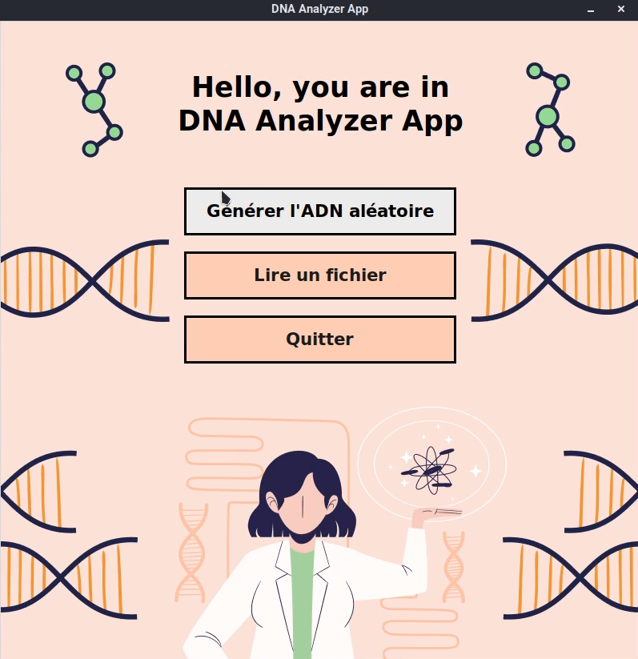
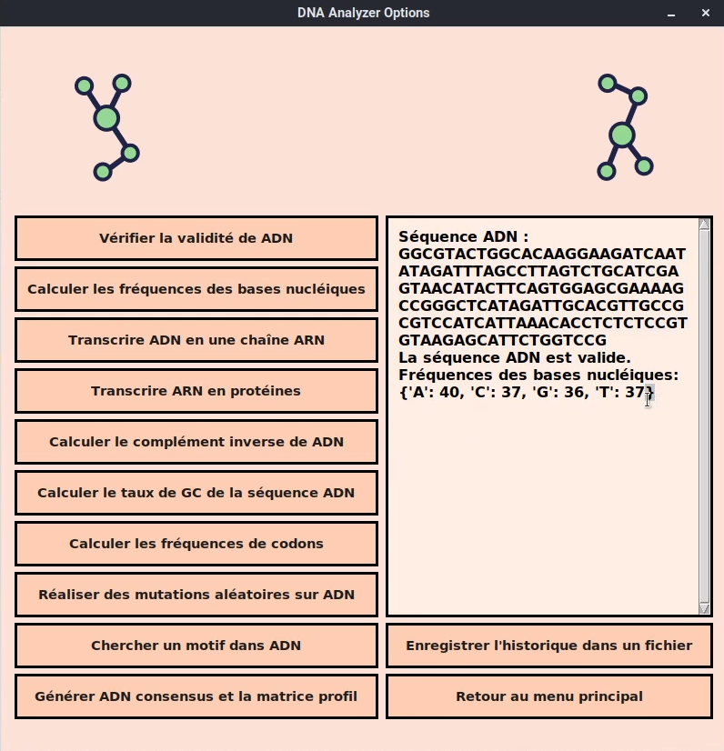

# DNA Sequence Analysis Toolkit 🧬

Ce projet est une application Python développée dans le cadre du module "Système et Programmation de Scripts" du Master 1 Bio-Informatique (USTHB). Il fournit une boîte à outils complète pour l'analyse de séquences d'ADN, accessible via une interface graphique (GUI) ou une interface en ligne de commande (CLI).

## ✨ Captures d'écran de l'Interface Graphique

L'application offre une expérience utilisateur intuitive grâce à son interface construite avec Tkinter.

**Menu Principal :**


**Fenêtre d'Analyse :**


## 🚀 Fonctionnalités

L'application permet de réaliser un large éventail d'opérations sur des séquences d'ADN, qu'elles soient générées aléatoirement ou lues depuis un fichier.

- **Gestion de Séquence :**
  - Générer une chaîne ADN aléatoire d'une longueur donnée.
  - Charger une séquence ADN depuis un fichier (`.fasta`, `.txt`, etc.).
  - Vérifier la validité d'une séquence (contient uniquement A, C, G, T).

- **Analyses Fondamentales :**
  - **Fréquence des bases :** Calculer le nombre d'occurrences de chaque nucléotide (A, C, G, T).
  - **Taux de GC :** Calculer le pourcentage de bases G et C dans la séquence.
  - **Transcription :** Convertir une séquence d'ADN en sa correspondante d'ARN.
  - **Traduction :** Traduire une séquence d'ARN en sa séquence de protéines (acides aminés).
  - **Complément Inverse :** Générer la séquence complémentaire inverse.
  - **Fréquence des codons :** Calculer la fréquence de chaque codon de trois nucléotides.

- **Fonctionnalités Avancées :**
  - **Mutation Ponctuelle :** Introduire un nombre spécifié de mutations par substitution.
  - **Recherche de Motif :** Trouver toutes les occurrences d'un sous-motif dans la séquence.
  - **Séquence Consensus :** À partir d'un ensemble de séquences, générer la matrice de profil et la chaîne ADN consensus.

- **Utilitaire :**
  - Sauvegarder l'historique des analyses et des résultats dans un fichier texte.

## 🔧 Comment l'utiliser

1.  **Clonez ce dépôt :**
    ```bash
    git clone https://github.com/VOTRE_NOM_UTILISATEUR/DNA-Sequence-Analyzer.git
    cd DNA-Sequence-Analyzer
    ```

2.  **(Optionnel mais recommandé) Créez un environnement virtuel :**
    ```bash
    python -m venv env
    # Sur Windows
    .\env\Scripts\activate
    # Sur macOS/Linux
    source env/bin/activate
    ```

3.  **Installez les dépendances nécessaires :**
    ```bash
    pip install -r requirements.txt
    ```

4.  **Lancez l'application de votre choix :**

    - **Pour l'interface graphique (GUI) :**
      ```bash
      python App.py
      ```
    - **Pour l'interface en ligne de commande (CLI) :**
      ```bash
      python Menu.py
      ```

## 📂 Structure du Projet

Le code est organisé de manière modulaire pour une meilleure lisibilité et maintenance :
- `App.py`: Point d'entrée de l'application graphique (Tkinter).
- `Menu.py`: Point d'entrée de l'application en ligne de commande.
- `ADN_*.py`, `Count_*.py`, etc. : Modules contenant chacun une fonction bio-informatique spécifique.
- `/assets` : Contient les images utilisées par l'interface graphique.
- `/sample_data` : Contient des fichiers d'exemples de séquences.
- `enonce_projet.pdf` : Le document original décrivant le projet.